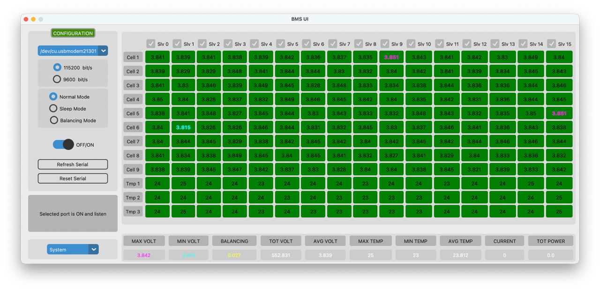
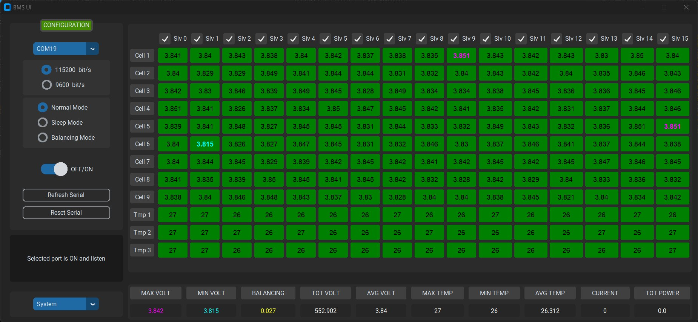

# GUI BMS PYTHON

A custom Python Tkinter project is designed to repeatedly read a struct sent via serial communication and display the data in a user-friendly manner. This project was developed for the needs of my Formula SAE team.

## Screenshots

